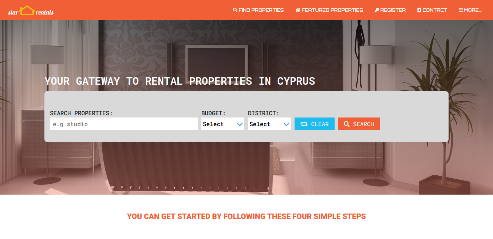
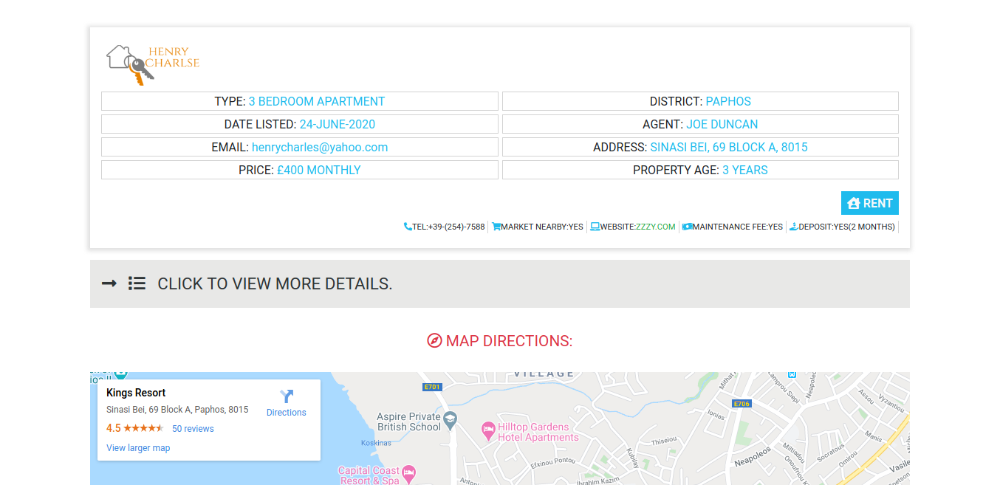
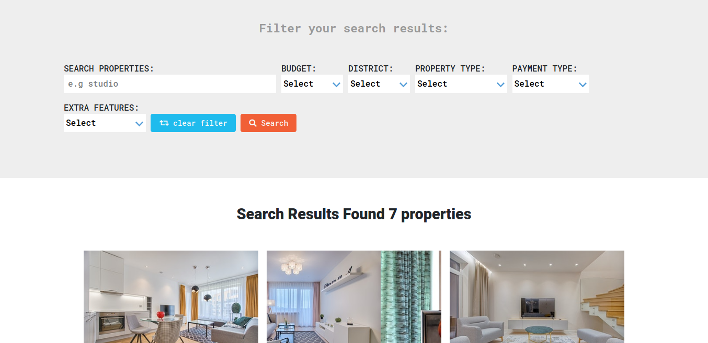

# Online Directory of Rental Properties

> I built this project using similar design concepts and layouts from [behence](https://www.behance.net/gallery/25563385/PatashuleKE). The site is mobile friendly and responsive.

## Built With

- HTML5
- CSS3
- Bootstrap

## Live Demo

[Check it out!](https://property-rental-by-paul.netlify.app/) and don't forget to resize your browser :blush:

## Authors

👤 **Author**

- Email: [ajuzepaul@gmail.com](ajuzepaul@gmail.com)
- Github: [@misterpaul4](https://github.com/misterpaul4)
- Twitter: [@paulajuze](https://twitter.com/paulajuze)
- Linkedin: [Chukwuebuka Paul Ajuizeogu](https://www.linkedin.com/in/chukwuebuka-paul-ajuizeogu/)

## 🤝 Contributing

Contributions, issues and feature requests are welcome!

Feel free to check the [issues page](issues/).

## Show your support

Give a ⭐️ if you like this project!

## Acknowledgments

- Design concepts was inspired by [Mathew Njuguna and others on Behance](https://www.behance.net/gallery/25563385/PatashuleKE)
- Images gotten from [pexels.com](https://www.pexels.com/)
- Images optimized with [tinnypng](https://tinypng.com/)
- Icons gotten from [font awesome](https://fontawesome.com/) and [iconmonstr](https://iconmonstr.com/)
